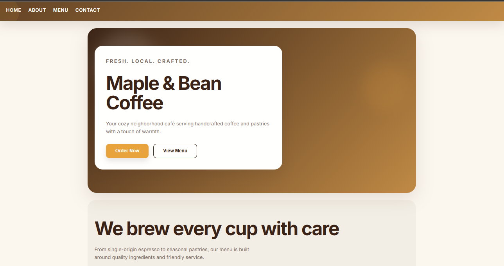
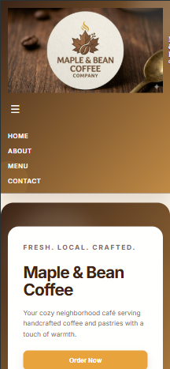
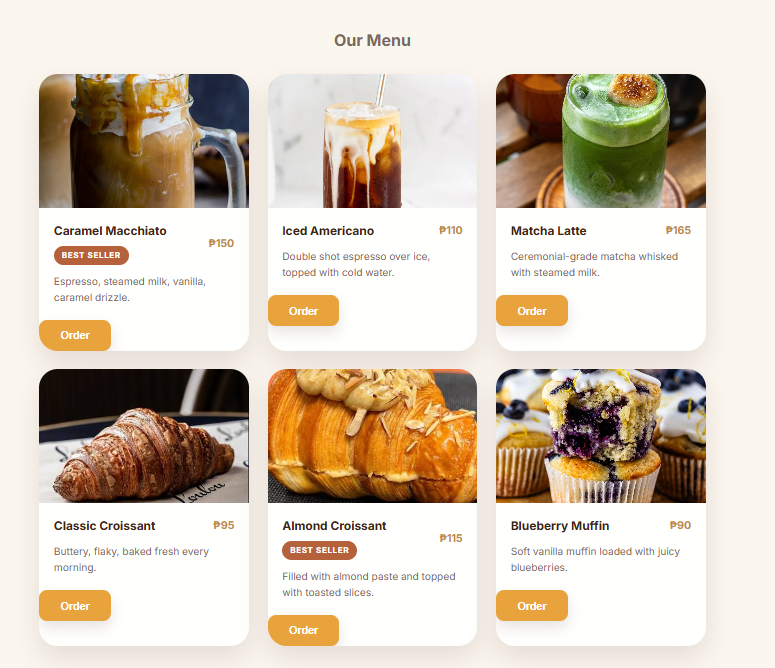
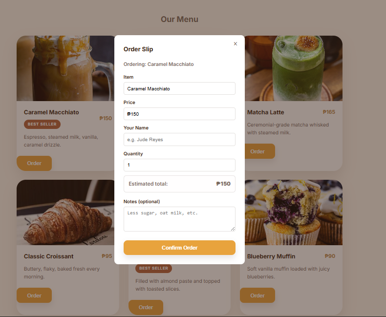
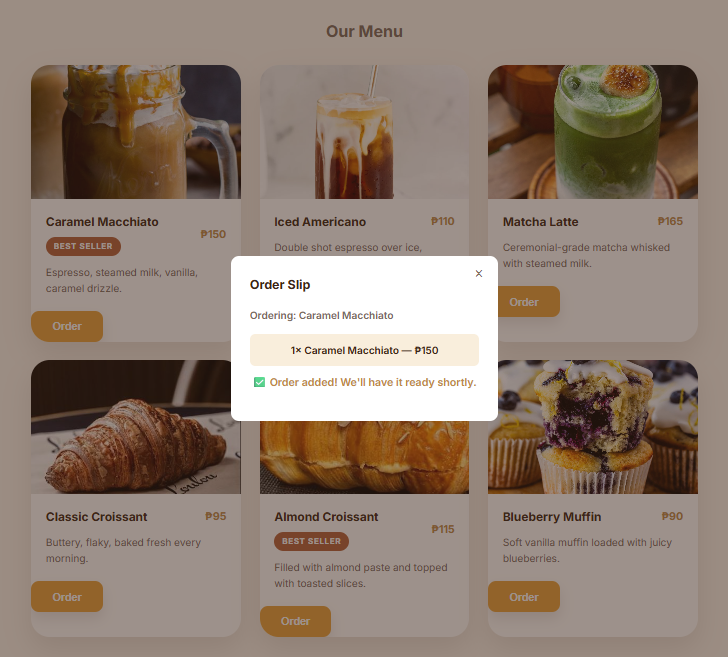

# ☕ Maple & Bean Coffee

A modern, fully responsive coffee shop landing page built from scratch using HTML5, CSS3, and JavaScript. Features a custom café design, interactive order modal, mobile-friendly navigation, smooth animations, and optimized user experience across devices.

## 🌐 Live Demo

https://mapleandbeancoffee.netlify.app/

## 💻 Source Code

https://github.com/JudeReyes/coffee-shop-landing-page

---

# 📖 Overview

Maple & Bean Coffee is a responsive coffee shop landing page featuring an interactive ordering experience, modern UI design, and smooth user interactions.

---

# ✨ Features

- ☕ Custom café branding
- 📱 Fully responsive layout
- 🍔 Mobile hamburger navigation
- 🛒 Interactive order modal
- ✅ Instant order confirmation
- ⚡ Smooth scrolling
- 🎬 Scroll animations
- 🚀 Deployed with Netlify

---

# 🛠 Tech Stack

- HTML5
- CSS3
- JavaScript
- Git
- GitHub
- Netlify

---

# 📷 Screenshots

## 🖥️ Desktop

---

## 📱 Mobile Navigation

---

## ☕ Menu Section

---

## 🛒 Order Modal

---

## ✅ Order Confirmation

---

# 👨‍💻 Author

**Jude Reyes**

Tech & Automation Virtual Assistant

Portfolio:
https://jude-va-portfolio.lovable.app/

LinkedIn:
https://www.linkedin.com/in/judereyes0618
